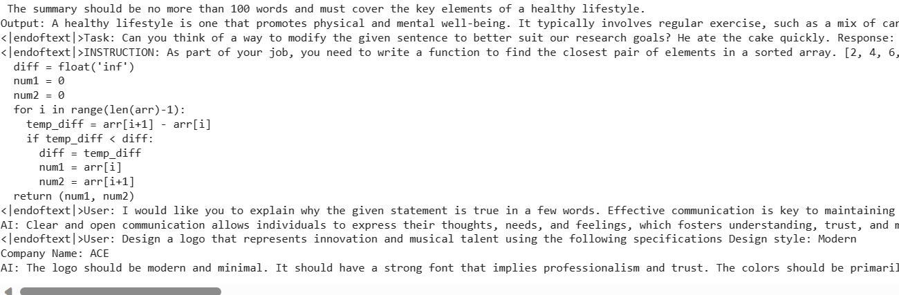

# Microsoft-Phi-2-Streamlit

Microsoft Phi 2 Streamlit App, deployed on [HuggingFace Spaces](https://huggingface.co/spaces) is based on the Microsoft Phi 2 small language model (SLM) for text generation. Utilizing [Streamlit](https://streamlit.io/), this application enables users to effortlessly engage with Phi 2, generating text that is contextually rich in response to their prompts.

- See - [Deployment](https://huggingface.co/spaces/shrimantasatpati/Microsoft_Phi2_Streamlit)
- Colab - [Google Colab](https://colab.research.google.com/drive/1RgdgPYKEegmlkLVtaKa3ogUK0Iy9zdQ6?authuser=2#scrollTo=7ACJCRPWOG3j)

##### Temperature - 0.9, max_new_tokens = 512
- It is a bit irrelevant in the output as temperature (parameter for creativity of prompt output).


  ## Getting Started

1. **Clone the Repository:**
   ```bash
   git clone https://github.com/your-username/Microsoft-Phi-2-Streamlit.git
   cd microsoft-phi2-streamlit-app
   ```

2. **Install Dependencies:**
   ```bash
   pip install -r requirements.txt
   ```

3. **Run the App:**
   ```bash
   streamlit run app.py
   ```
   This command will launch the app in your default web browser.

## Usage

1. Enter your text prompt in the provided text area.
2. Click the "Generate" button to initiate text generation based on your prompt.
3. Explore the generated output provided by the Microsoft Phi 2 language model.

## Acknowledgments

- Microsoft Phi 2 language model - Microsoft Research team in advancing language model capabilities. 
- Streamlit development group.

## License

This project is licensed under the MIT License - see the [LICENSE](LICENSE) file for details.
